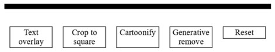
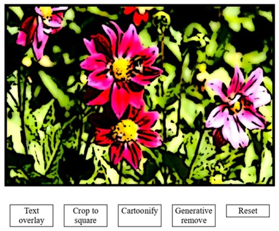
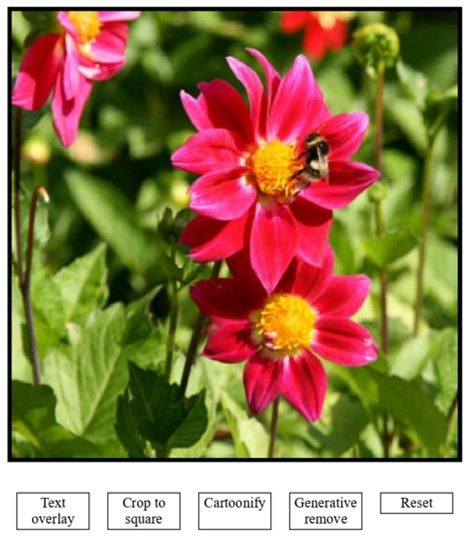
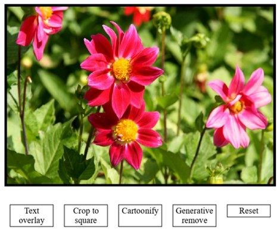

# Tutorial: Build an Interactive Image Transformer with Cloudinary's JS SDK

## Meta description

Build a simple HTML/CSS/JS app with the Cloudinary JavaScript SDK to load images, apply transformations, and experiment with AI-powered effects.

## Overview

In this tutorial, you'll build a simple HTML/CSS/JS app that:

* Loads an image from Cloudinary.
* Renders it in the browser.
* Lets you apply transformations with a single click.

**Time to complete:** 10 minutes.

> **Note:** Cloudinary's SDK includes many more transformations and options than we'll cover here. This tutorial focuses on a few core examples and provides links to the docs for further exploration.

You can explore the completed app here: [Live Demo](https://mhornstein.github.io/Cloudinary-Test/)

## Quick Background

### Why use image transformations?

Transformations let you dynamically resize, crop, adjust quality, and apply effects to your media. This ensures every user receives an optimized version without needing to create or store multiple files.

### Why use the JavaScript SDK?

Transformations can be applied by manually constructing delivery URLs. However, the JavaScript SDK makes this process simpler and less error-prone by providing a clear, chainable API for defining transformations in code. Behind the scenes, both approaches achieve the same result.

## 1. Prepare the HTML and CSS scaffold

The HTML and CSS are provided so you can focus entirely on the JavaScript SDK.

**Project layout**

```
/ (project root)
├─ index.html
└─ styles.css
```

### index.html

```html
<!doctype html>
<html lang="en">
<head>
  <meta charset="utf-8" />
  <link rel="stylesheet" href="styles.css">
  <title>Cloudinary Demo</title>
</head>
<body>
  <div class="main">
    <div class="main-photo">
      
    </div>
    <div class="btn-group">
      <div class="btn" id="text-btn">Text overlay</div>
      <div class="btn" id="crop-btn">Crop to square</div>
      <div class="btn" id="cartoonify-btn">Cartoonify <br>&nbsp;</br></div>
      <div class="btn" id="genremove-btn">Generative remove</div>
      <div class="btn" id="reset-btn">Reset</div>
    </div>
  </div>

  <script type="module">
    // JavaScript code will go here
  </script>
</body>
</html>
```

### styles.css

```css
.main {
  width: 800px;
  margin: auto;
}
.main-photo {
  width: 500px;
  border: 5px solid black;
  margin: 20px 0;
  display: inline-block;
}
.main-photo img {
  width: 100%;
  height: auto;
  display: block;
}
.btn-group {
  width: 100%;
  text-align: center;
}
.btn {
  margin: 10px;
  padding: 2px 5px;
  float: left;
  width: 70px;
  border: 1px solid black;
  background-color: lightblue;
}
.btn:hover {
  cursor: pointer;
}
```
This is the page you should expect to see rendered:



The page shows an empty image frame (just the border) with the row of buttons underneath. 

The image area is intentionally blank because the `` element has no `src`. You'll populate it with an image in Step 3.

## 2. Load an image from Cloudinary

Replace the placeholder comment inside the `<script>` tag (in `index.html`) with the following JavaScript code. It imports the Cloudinary JavaScript SDK (URL Generation) and creates a `CloudinaryImage` object, which represents an image stored in a Cloudinary account.

```js
import { Cloudinary } from "https://cdn.skypack.dev/@cloudinary/url-gen";

const CLOUD_NAME = "demo";
const PUBLIC_ID  = "sample.jpg";

const cld = new Cloudinary({ cloud: { cloudName: CLOUD_NAME } });

let myImage = cld.image(PUBLIC_ID);
```
This example connects to the Cloudinary demo account (`demo`), which already includes the `sample.jpg` image.

<details>
<summary>More info about Configuration...</summary>

The SDK supports various [configuration parameters](https://cloudinary.com/documentation/cloudinary_sdks#configuration_parameters) when creating the `Cloudinary` instance. Here we're setting `cloudName` to the `demo` cloud, but you can replace it with your own. See the docs for all available options.
</details>

## 3. Render the image

Add the following code to update the `` element's src with the URL generated from the `CloudinaryImage` object. The `renderImage` helper function makes the code reusable.

```js
const imgEl = document.getElementById("main-img");

function renderImage(imageElement, cloudinaryImage) {
  imageElement.src = cloudinaryImage.toURL();
}

renderImage(imgEl, myImage);
```


## 4. Implement the Cartoonify effect

Cartoonify is the easiest effect to try, and it instantly turns your image into a fun, cartoon-like style.

Import the effect:

```js
import { cartoonify } from "https://cdn.skypack.dev/@cloudinary/url-gen/actions/effect";
```

Add a click listener to the **Cartoonify button**. When clicked, it applies the effect to the `CloudinaryImage` and re-renders it using the `renderImage` function defined in the previous step:

```js
document.getElementById("cartoonify-btn").addEventListener("click", () => {
  myImage.effect(cartoonify());
  renderImage(imgEl, myImage);
});
```
`myImage` works like a builder: each call (such as `.effect(cartoonify())`) adds another step to the transformation pipeline. That's why you can reuse the same instance and just re-render it.



<details>
<summary>More info about transformations...</summary>

There are many ways to transform your assets - find them all in the [Transformation reference](https://cloudinary.com/documentation/transformation_reference). You can also explore [alternative ways to apply transformations](https://cloudinary.com/documentation/javascript_image_transformations#alternative_ways_to_apply_transformations) with the JavaScript SDK.
</details>
<details>
<summary>More info about Cartoonify...</summary>

Learn more about the effect and its options in the [Cartoonify docs](https://cloudinary.com/documentation/transformation_reference#e_cartoonify).
</details>

## 5. Implement text overlay

Sometimes you might need words on your image - like a caption, a label, or a quick note - and with overlays you can add them in seconds without making a new copy of the image every time.

Import the text overlay action:

```js
import { source } from "https://cdn.skypack.dev/@cloudinary/url-gen/actions/overlay";
import { text } from "https://cdn.skypack.dev/@cloudinary/url-gen/qualifiers/source";
import { TextStyle } from "https://cdn.skypack.dev/@cloudinary/url-gen/qualifiers/textStyle";
```

Add a click listener to the **Text overlay** button. When clicked, it applies a text overlay to the CloudinaryImage and re-renders.

```js
document.getElementById("text-btn").addEventListener("click", () => {
  myImage.overlay(
    source(
      text("Text overlay", new TextStyle("Arial", 50)).textColor("white")
    )
  );
  renderImage(imgEl, myImage);
});
```
The `overlay()` method adds a text layer on top of the base image. In this example, the text is "Text overlay", styled with the Arial font, size 50, and white color. 

**Try it yourself:** experiment with different fonts, sizes, and colors.


<details>
<summary>More info about actions vs. effects...</summary>

In the Cloudinary SDK, **actions** and **effects** serve different purposes:

- **Actions** describe transformations that *change the structure* of your asset. For example, `overlay()` places text on top of the original asset.
- **Effects** (like `cartoonify()`) apply *visual filters or stylistic changes* to the asset.

Both are part of the same transformation pipeline, and you can stack actions with effects.
</details>

<details>
<summary>More info about text overlays...</summary>

See the [Text overlays guide](https://cloudinary.com/documentation/layers#text_overlays) to learn more about about fonts, styling, positioning, and encoding.
</details>

## 6. Implement Crop to square

Cropping is one of the most common edits, and Cloudinary gives you powerful tools to make it effortless while still delivering great results.

Import the resize action and gravity qualifier:

```js
import { fill } from "https://cdn.skypack.dev/@cloudinary/url-gen/actions/resize";
import { autoGravity } from "https://cdn.skypack.dev/@cloudinary/url-gen/qualifiers/gravity";
```

Add a click listener to the **Crop to square** button. When clicked, it resizes the `CloudinaryImage` to a 1:1 aspect ratio and re-renders it:

```js
document.getElementById("crop-btn").addEventListener("click", () => {
  myImage.resize(
    fill()
      .width(333)
      .aspectRatio("1:1")
      .gravity(autoGravity())
  );
  renderImage(imgEl, myImage);
});
```

The `resize().fill()` method crops and resizes the image to fit the specified dimensions. Here, the width is set to 333 pixels and the aspect ratio to 1:1, producing a square image. The `autoGravity()` setting automatically selects the most important region of the image (like a face or object) so the crop stays focused.

**Try it yourself:** Adjust the width or aspect ratio values to experiment with different crops, or remove the `.gravity(autoGravity())` command to see its effect.



<details>
<summary>More info about qualifiers...</summary>

In the Cloudinary SDK, **qualifiers** provide extra details that shape how an action behaves.  
Think of them as parameters or settings you attach to an action:

- For example, in a resize action, `autoGravity()` is a qualifier that tells Cloudinary which part of the image to keep in focus.  
- In a text overlay, `TextStyle("Arial", 50)` is a qualifier that defines the font and size of the text.

Qualifiers don't do anything on their own - they *qualify* an action like `resize()` or `overlay()` to make it more specific.
</details>
<details>
<summary>More info about resizing & cropping...</summary>

Read more about [image resizing and cropping](https://cloudinary.com/documentation/resizing_and_cropping), including qualifiers like `gravity` and `aspect_ratio` used in this example.
</details>

## 7. Generative Remove

Let's add some AI magic with a generative effect. As before, start by importing the generative remove effect:

```js
import { generativeRemove } from "https://cdn.skypack.dev/@cloudinary/url-gen/actions/effect";
```

Add a click listener to the **Generative remove** button. When clicked, it applies the effect with a prompt and then re-renders:

```js
document.getElementById("genremove-btn").addEventListener("click", () => {
  myImage.effect(
    generativeRemove().prompt("bee")
  );
  renderImage(imgEl, myImage);
});
```

`generativeRemove()` uses AI to remove a **single object or region** that matches your prompt and fills the gap with realistic pixels. Here the prompt is `"bee"`.

**Try it yourself:** Replace `"bee"` with `"tree"`, `"person"`, or `"logo"` to remove different elements. Use more descriptive phrases, like `"red flower"` or `"text on the sign"`, to target specific details.



<details>
<summary>More info about Generative Remove...</summary>

Learn how prompts work, explore available parameters, and try other generative effects in the [Generative Remove docs](https://cloudinary.com/documentation/generative_ai_transformations#generative_remove).
</details>

## 8. Reset button

To wrap up the app, let's add a reset button that restores the image to its original state. That way, if things get out of hand, the Reset button takes you back to square one.

Add a click listener to the Reset button. When clicked, it creates a fresh CloudinaryImage pointing to the original asset and re-renders it:

```js
document.getElementById("reset-btn").addEventListener("click", () => {
  myImage = cld.image(PUBLIC_ID);
  renderImage(imgEl, myImage);
});
```

Why recreate the object? Each transformation you apply - such as crop, overlay, or cartoonify - is appended to the same `myImage` instance. As a result, transformations accumulate. By instantiating a new CloudinaryImage that points to the original asset, you reset the state and restore the image to its unmodified form.

## Summary

In this tutorial, you built a simple HTML/CSS/JS app that loads an image from Cloudinary and applies transformations using the JavaScript SDK. You've experienced firsthand how transformations let you adapt images on the fly, and how the SDK makes them easy to apply with clean, reusable code.

## View the completed code

You can find the full source code for this tutorial on [GitHub](https://github.com/mhornstein/Cloudinary-Test/tree/main/part2).

## Follow-up ideas
Here are some ideas to keep exploring:
1. **Stack transformations**: Try applying several transformations in a row (for example, add text, then crop, then cartoonify) to see how they accumulate on the same image.
2. **Try more transformations**: Check out [Cloudinary's transformation reference](https://cloudinary.com/documentation/transformation_reference) and experiment with other transformations you can apply.
3. **Use your own image**: Swap in assets from your own Cloudinary account to make the demo personal.