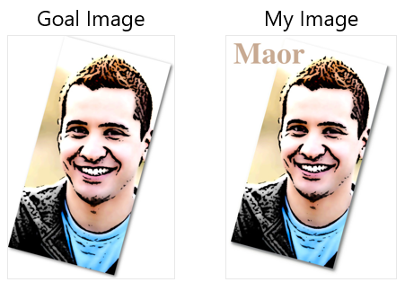

# Image URL Transformation Challenge

In this challenge, I experimented with Cloudinary transformation URLs to achieve a given end result, and also added my name on top of the image.

The URL I created is:  
```js
https://res.cloudinary.com/demo/image/upload/c_fill,h_565,w_283,g_face/e_cartoonify/co_rgb:828488,e_shadow:30,x_3/co_rgb:8C8F8B,e_shadow:30,y_1/co_rgb:FBFCF9,e_shadow:30,x_-3/co_rgb:EEEEEE,e_shadow:30,y_-1/a_15/co_rgb:91542480,l_text:Times_80_bold:Maor/fl_layer_apply,g_north_west,y_20,x_20/smiling_man.jpg
```

The images are:  
  

## My Process - Key Takeaways
1. **Documentation as a key resource** - I initially used the console to experiment with transformations, but once I turned to the Cloudinary documentation, with its detailed examples and visuals, I found it to be a much more effective and convenient resource.  
2. **Shadows were tricky** - At first, I tried using drop shadow and even outline, but eventually the shadow transformation gave me what I needed. I wasn't entirely happy applying the same transformation four times, but I couldn't find a better approach - which leads me to the next point...  
3. **Consulting with AI** - I used the Cloudinary bot primarily to ask about shadows and whether repeating the transformation was considered best practice. I must also admit that, although I had a dedicated bot available, I turned to ChatGPT quite often - likely because it's the tool I'm most accustomed to. This experience could be an interesting point for further discussion.
